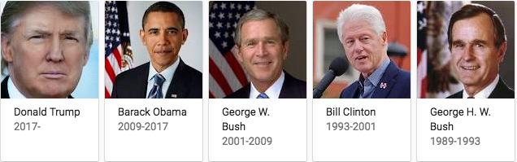

##Where the story begins:

As we all know, United States of American is a young country. But in its 241 years history, US has grown up as the most powerful country all over the world quickly. When we are suprised by its amaziong growing spped, I want to find something also repaidly changed in this country. So I decide to analyse the Presidents' Inaugural Speeches by comparing recent presidents and their great antecessors, who built the solid foundation of USA. First, let's take a look at them!  

  


  

Clearly, their hairstyles changed a lot as time went by. But today, I will focus more on thier **Inaugural Speeches Topics** rather than hairstyle. To realize this analysis, I will use topic modeling method given in last lecture.

### Step 0: Check and install needed packages. Load the libraries and functions. 
```{r echo=TRUE, message=FALSE, warning=FALSE}
packages.used=c("rvest", "tibble", "qdap", 
                "sentimentr", "gplots", "dplyr",
                "tm", "syuzhet", "factoextra", 
                "beeswarm", "scales", "RColorBrewer",
                "RANN", "tm", "topicmodels","tidytext",
                "wordCloud","RColorBrewer", "readxl")

# check packages that need to be installed.
packages.needed=setdiff(packages.used, 
                        intersect(installed.packages()[,1], 
                                  packages.used))
# install additional packages
if(length(packages.needed)>0){
  install.packages(packages.needed, dependencies = TRUE)
}

# load packages
library("rvest")
library("tibble")
# You may need to run
# sudo ln -f -s $(/usr/libexec/java_home)/jre/lib/server/libjvm.dylib /usr/local/lib
# in order to load qdap
library("qdap")
library("sentimentr")
library("gplots")
library("dplyr")
library("tm")
library("syuzhet")
library("factoextra")
library("beeswarm")
library("scales")
library("RColorBrewer")
library("RANN")
library("tm")
library("topicmodels")
library("tidytext")
library("wordcloud")
library("RColorBrewer")
library("readxl")
source("../lib/plotstacked.R")
source("../lib/speechFuncs.R")

# a function to plot wordcloud of specific speech
source("../lib/speechesCLoud.R") 
```

```{r}
print(R.version)
```

#Part 1- Topic Analysis of Inaugural Speeches
## Step 1: Data processing -- import Data
In this step, we combine the information of each inaugural speeches into one list named **inaug.list**.

```{r echo=TRUE, message=FALSE, warning=FALSE}
### Inauguaral speeches
main.page <- read_html(x = "http://www.presidency.ucsb.edu/inaugurals.php")
# Get link URLs
# f.speechlinks is a function for extracting links from the list of speeches. 
inaug=f.speechlinks(main.page)

colnames(inaug) <- c("Date","Links")
# To avoid some problems when we transform the date format.
if(Sys.getlocale("LC_TIME") != "C"){
  Sys.setlocale("LC_TIME","C")
}


inaug[,1] <-as.Date(inaug[,1], format="%B %e, %Y")
inaug=inaug[-nrow(inaug),] # remove the last line, irrelevant due to error.

# Import the information data of inauguration speeches.
inaug.list <- read_excel("../data/InaugurationInfo.xlsx")
inaug.list <- cbind(inaug.list,inaug)

# Read in full text
inaug.list$fulltext=NA
for(i in seq(nrow(inaug.list))) {
  text <- read_html(inaug.list$Links[i]) %>% # load the page
    html_nodes(".displaytext") %>% # isloate the text
    html_text() # get the text
  inaug.list$fulltext[i]=text
}
head(inaug.list)
```


## Step 2: Data Processing --- generate list of sentences


```{r,message=FALSE, warning=FALSE}
sentence.list=NULL
for(i in 1:nrow(inaug.list)){
  sentences=sent_detect(inaug.list$fulltext[i],
                        endmarks = c("?", ".", "!", "|",";"))
  if(length(sentences)>0){
    emotions=get_nrc_sentiment(sentences)
    word.count=word_count(sentences)
    # colnames(emotions)=paste0("emo.", colnames(emotions))
    # in case the word counts are zeros?
    emotions=diag(1/(word.count+0.01))%*%as.matrix(emotions)
    sentence.list=rbind(sentence.list, 
                        cbind(inaug.list[i,-ncol(inaug.list)],
                              sentences=as.character(sentences), 
                              word.count,
                              emotions,
                              sent.id=1:length(sentences)
                              )
    )
  }
}

# omit NAs
sentence.list$Type = "inaug"
sentence.list=
  sentence.list%>%
  filter(!is.na(word.count))

```

## Step 3: Data analysis --- Topic modeling
### Create snippets corpus
For topic modeling, we prepare a corpus of sentence snippets as follows. For each speech, we start with sentences and prepare a snippet with a given sentence with the flanking sentences. And then we use these snipets to creat our corpus to analysis.

```{r}
# prepare sentence snippets (3 continuing sentences)
corpus.list=sentence.list[2:(nrow(sentence.list)-1), ]
sentence.pre=sentence.list$sentences[1:(nrow(sentence.list)-2)]
sentence.post=sentence.list$sentences[3:(nrow(sentence.list)-1)]
corpus.list$snippets=paste(sentence.pre, corpus.list$sentences, sentence.post, sep=" ")

# avoid snippets combining senstences from different speeches
rm.rows=(1:nrow(corpus.list))[corpus.list$sent.id==1]
rm.rows=c(rm.rows, rm.rows-1)
corpus.list=corpus.list[-rm.rows, ]

# creat our corpus
docs <- Corpus(VectorSource(corpus.list$snippets))
```


### Clean our corpus

For this corpus, we remove extra white space, convert all letters to the lower case, remove [stop words](https://github.com/arc12/Text-Mining-Weak-Signals/wiki/Standard-set-of-english-stopwords), removed empty words due to formatting errors, and remove punctuation. Then we compute the [Document-Term Matrix (DTM)](https://en.wikipedia.org/wiki/Document-term_matrix). 
```{r}
#remove potentially problematic symbols
docs <-tm_map(docs,content_transformer(tolower))
docs <- tm_map(docs, removePunctuation)
docs <- tm_map(docs, removeNumbers)
docs <- tm_map(docs, removeWords, stopwords("english"))
docs <- tm_map(docs, stripWhitespace)
docs <- tm_map(docs,stemDocument)

#compute Document-Term Matrix
dtm <- DocumentTermMatrix(docs)
#convert rownames to filenames#convert rownames to filenames
rownames(dtm) <- paste(corpus.list$File,
                       corpus.list$Term, corpus.list$sent.id, sep="_")

rowTotals <- apply(dtm , 1, sum) #Find the sum of words in each Document

dtm  <- dtm[rowTotals> 0, ]
corpus.list=corpus.list[rowTotals>0, ]
```

### Run LDA topic models

```{r}
#Set parameters for Gibbs sampling
burnin <- 4000
iter <- 2000
thin <- 500
seed <-list(2003,5,63,100001,765)
nstart <- 5
best <- TRUE

#Number of topics
k <- 15

#Run LDA using Gibbs sampling
ldaOut <-LDA(dtm, k, method="Gibbs", control=list(nstart=nstart, 
                                                 seed = seed, best=best,
                                                 burnin = burnin, iter = iter, 
                                                 thin=thin))
#write out results
#docs to topics
ldaOut.topics <- as.matrix(topics(ldaOut))
table(c(1:k, ldaOut.topics))
write.csv(ldaOut.topics,file=paste("../output/LDAGibbs",k,"DocsToTopics.csv"))

#top 6 terms in each topic
ldaOut.terms <- as.matrix(terms(ldaOut,15))
write.csv(ldaOut.terms,file=paste("../output/LDAGibbs",k,"TopicsToTerms.csv"))

#probabilities associated with each topic assignment
topicProbabilities <- as.data.frame(ldaOut@gamma)
write.csv(topicProbabilities,file=paste("../output/LDAGibbs",k,"TopicProbabilities.csv"))
```

### Analysis of topics
```{r}
terms.beta=ldaOut@beta
terms.beta=scale(terms.beta)
topics.terms=NULL
for(i in 1:k){
  topics.terms=rbind(topics.terms, ldaOut@terms[order(terms.beta[i,], decreasing = TRUE)[1:7]])
}
topics.terms
ldaOut.terms
```

From the 15 topics in LDA result, we can conclude 15 topic names by studing their components.Based on the most popular terms and the most salient terms for each topic, we can get the following hashtags to each topic.
```{r}
topics.hash=c("Military", "WorldPeace", "Time", "Economy", 
              "Nation", "Responsibility", "Hope", "Equality", 
              "America", "Politic", "WorkingFamilies", "Legislation", 
              "Community", "Government", "Patriotism")
corpus.list$ldatopic=as.vector(ldaOut.topics)
corpus.list$ldahash=topics.hash[ldaOut.topics]

colnames(topicProbabilities)=topics.hash
corpus.list.df=cbind(corpus.list, topicProbabilities)
```

## Clustering of topics
Now we have topics and thier probabilitie given by LDA model. Then we can cluster them.
```{r, fig.width=5, fig.height=9}
par(mar=c(1,1,1,1))
topic.summary=tbl_df(corpus.list.df)%>%
              select(File, Military:Patriotism)%>%
              group_by(File)%>%
              summarise_all(funs(mean))
topic.summary=as.data.frame(topic.summary)
rownames(topic.summary)=topic.summary[,1]

# [1] "Military"   "WorldPeace"  "Time"  "Economy", 
# [5] "Nation"  "Responsibility"  "Hope"  "Equality", 
# [9] "America"  "Politic"  "WorkingFamilies"  "Legislation", 
# [13] "Community"  "Government"  "Patriotism"

topic.plot=c(1 :15)
print(topics.hash[topic.plot])

heatmap.2(as.matrix(topic.summary[,topic.plot+1]), 
          scale = "column", key=F, 
          col = bluered(100),
          cexRow = 0.9, cexCol = 0.9, margins = c(8, 8),
          trace = "none", density.info = "none", main="All presidents")
```

From above clustering fig, it seems the topic did not clustered very clearly. So we go to the next step and pick up the most recent 5 presidents, the first 5 presidents and 5 presidents from the middle of timeline.

```{r}
recent_presidents <- c("GeorgeBush","WilliamJClinton","GeorgeWBush","BarackObama","DonaldJTrump")
middle_presidents <- c("BenjaminHarrison","GroverCleveland-I","WilliamMcKinley",
                       "TheodoreRoosevelt","WilliamHowardTaft")
founding_presidents <- c("GeorgeWashington","JohnAdams","ThomasJefferson","JamesMadison","JamesMonroe")
```

Then we do cluster again:
```{r, fig.width=5, fig.height=5}
par(mar=c(1,1,1,1))

recent_df <- NULL
for(i in 1:length(recent_presidents)){
  recent_df <- rbind(recent_df, corpus.list.df[corpus.list.df$File==recent_presidents[i],])
}
topic.summary=tbl_df(recent_df)%>%
              select(File, Military:Patriotism)%>%
              group_by(File)%>%
              summarise_all(funs(mean))
topic.summary=as.data.frame(topic.summary)
rownames(topic.summary)=topic.summary[,1]

# [1] "Military"   "WorldPeace"  "Time"  "Economy", 
# [5] "Nation"  "Responsibility"  "Hope"  "Equality", 
# [9] "America"  "Politic"  "WorkingFamilies"  "Legislation", 
# [13] "Community"  "Government"  "Patriotism"

topic.plot=c(1 :15)
print(topics.hash[topic.plot])

heatmap.2(as.matrix(topic.summary[,topic.plot+1]), 
          scale = "column", key=F, 
          col = bluered(100),
          cexRow = 0.9, cexCol = 0.9, margins = c(8, 8),
          trace = "none", density.info = "none",main="Recent 5 President")
```

```{r, fig.width=5, fig.height=5}
par(mar=c(1,1,1,1))

middle_df <- NULL
for(i in 1:length(middle_presidents)){
  middle_df <- rbind(middle_df, corpus.list.df[corpus.list.df$File==middle_presidents[i],])
}
topic.summary=tbl_df(middle_df)%>%
              select(File, Military:Patriotism)%>%
              group_by(File)%>%
              summarise_all(funs(mean))
topic.summary=as.data.frame(topic.summary)
rownames(topic.summary)=topic.summary[,1]

# [1] "Military"   "WorldPeace"  "Time"  "Economy", 
# [5] "Nation"  "Responsibility"  "Hope"  "Equality", 
# [9] "America"  "Politic"  "WorkingFamilies"  "Legislation", 
# [13] "Community"  "Government"  "Patriotism"

topic.plot=c(1 :15)
print(topics.hash[topic.plot])

heatmap.2(as.matrix(topic.summary[,topic.plot+1]), 
          scale = "column", key=F, 
          col = bluered(100),
          cexRow = 0.9, cexCol = 0.9, margins = c(8, 8),
          trace = "none", density.info = "none",main="Middle 5 Presidents")
```

```{r, fig.width=5, fig.height=5}
par(mar=c(1,1,1,1))

founding_df <- NULL
for(i in 1:length(founding_presidents)){
  founding_df <- rbind(founding_df, corpus.list.df[corpus.list.df$File==founding_presidents[i],])
}
topic.summary=tbl_df(founding_df)%>%
              select(File, Military:Patriotism)%>%
              group_by(File)%>%
              summarise_all(funs(mean))
topic.summary=as.data.frame(topic.summary)
rownames(topic.summary)=topic.summary[,1]

# [1] "Military"   "WorldPeace"  "Time"  "Economy", 
# [5] "Nation"  "Responsibility"  "Hope"  "Equality", 
# [9] "America"  "Politic"  "WorkingFamilies"  "Legislation", 
# [13] "Community"  "Government"  "Patriotism"

topic.plot=c(1 :15)
print(topics.hash[topic.plot])

heatmap.2(as.matrix(topic.summary[,topic.plot+1]), 
          scale = "column", key=F, 
          col = bluered(100),
          cexRow = 0.9, cexCol = 0.9, margins = c(8, 8),
          trace = "none", density.info = "none",main="First 5 Presidents")
```

From the respectively clustering, we can find that the topic they emphasize are different from time to time. To be more clear, we can plot the topic share condition to the next step analysis.

## Topic shares

```{r, fig.width=9, fig.height=7}
# [1] "Military"  "WorldPeace"  "Time"  "Economy", 
# [5] "Nation"  "Responsibility"  "Hope"  "Equality", 
# [9] "America"  "Politic"  "WorkingFamilies"  "Legislation", 
# [13] "Community"  "Government"  "Patriotism"

par(mfcol=c(5, 3), mar=c(1,1,2,0), bty="n", xaxt="n", yaxt="n")

topic.plot=c(1,2,4,5,8,9,10,11,12,15)
print(topics.hash[topic.plot])


for(i in 5:1){
  speech.df=tbl_df(corpus.list.df)%>%filter(File==recent_presidents[i],  Term==1)%>%
    select(sent.id, Military:Patriotism)
  speech.df=as.matrix(speech.df)
  speech.df[,-1]=replace(speech.df[,-1], speech.df[,-1]<1/15, 0.001)
  speech.df[,-1]=f.smooth.topic(x=speech.df[,1], y=speech.df[,-1])
  plot.stacked(speech.df[,1], speech.df[,topic.plot+1],
               xlab="Sentences", ylab="Topic share", main=recent_presidents[i])
  
}


for(i in 5:1){
  speech.df=tbl_df(corpus.list.df)%>%filter(File==middle_presidents[i],  Term==1)%>%
    select(sent.id, Military:Patriotism)
  speech.df=as.matrix(speech.df)
  speech.df[,-1]=replace(speech.df[,-1], speech.df[,-1]<1/15, 0.001)
  speech.df[,-1]=f.smooth.topic(x=speech.df[,1], y=speech.df[,-1])
  plot.stacked(speech.df[,1], speech.df[,topic.plot+1],
               xlab="Sentences", ylab="Topic share", main=middle_presidents[i])
  
}

for(i in 5:1){
  speech.df=tbl_df(corpus.list.df)%>%filter(File==founding_presidents[i],  Term==1)%>%
    select(sent.id, Military:Patriotism)
  speech.df=as.matrix(speech.df)
  speech.df[,-1]=replace(speech.df[,-1], speech.df[,-1]<1/15, 0.001)
  speech.df[,-1]=f.smooth.topic(x=speech.df[,1], y=speech.df[,-1])
  plot.stacked(speech.df[,1], speech.df[,topic.plot+1],
               xlab="Sentences", ylab="Topic share", main=founding_presidents[i])
  
}

```

This is a topics share plot of 15 US presidents from 3 different time periods, especially between the recent speeches (first column) and old speeches (third column). Obviously, in each time period, there are some interesting unique characters of their innaugural speeches. In most recent speeches (first column), the share of yellow part and sky blue are really big, and we notice that they represent _"WorldPeace"_ and _"American"_. But in the oldest 5 speeches, the share of purple, pink and green are higher than them in another 2 columns, which represent _"Legislation"_, _"Patriotism"_ and _"Nation"_. The differernce between the most recent 5 and the oldest 5 are more significant than middle 5, so our next step is mainly on those 2 styles.


Here we choice their most similar and most different topics _("Military", "WorldPeace", "Economy", "Equality", "America", "Legislation","Patriotism")_ to compare:

```{r, fig.width=7, fig.height=7}
# [1] "Military"  "WorldPeace"  "Time"  "Economy", 
# [5] "Nation"  "Responsibility"  "Hope"  "Equality", 
# [9] "America"  "Politic"  "WorkingFamilies"  "Legislation", 
# [13] "Community"  "Government"  "Patriotism"

par(mfcol=c(5, 2), mar=c(1,1,2,0), bty="n", xaxt="n", yaxt="n")

topic.plot=c(1,2,4,8,9,12,15)
print(topics.hash[topic.plot])

recent_presidents <- c("GeorgeBush","WilliamJClinton","GeorgeWBush","BarackObama","DonaldJTrump")
founding_presidents <- c("GeorgeWashington","JohnAdams","ThomasJefferson","JamesMadison","JamesMonroe")

for(i in 5:1){
  speech.df=tbl_df(corpus.list.df)%>%filter(File==recent_presidents[i],  Term==1)%>%
    select(sent.id, Military:Patriotism)
  speech.df=as.matrix(speech.df)
  speech.df[,-1]=replace(speech.df[,-1], speech.df[,-1]<1/15, 0.001)
  speech.df[,-1]=f.smooth.topic(x=speech.df[,1], y=speech.df[,-1])
  plot.stacked(speech.df[,1], speech.df[,topic.plot+1],
               xlab="Sentences", ylab="Topic share", main=recent_presidents[i])
  
}

for(i in 5:1){
  speech.df=tbl_df(corpus.list.df)%>%filter(File==founding_presidents[i],  Term==1)%>%
    select(sent.id, Military:Patriotism)
  speech.df=as.matrix(speech.df)
  speech.df[,-1]=replace(speech.df[,-1], speech.df[,-1]<1/15, 0.001)
  speech.df[,-1]=f.smooth.topic(x=speech.df[,1], y=speech.df[,-1])
  plot.stacked(speech.df[,1], speech.df[,topic.plot+1],
               xlab="Sentences", ylab="Topic share", main=founding_presidents[i])
  
}

```


Clearly, the new fashion and old fashion are very different! Compared with thier antecessors, recent presidents seems focus more on WorldPeace (international affairs) when giving their inaguraul speeches. However, the first founders of this counrty cares more about Legislation and Patriotism. Besides, even if they both mentioned Military in their speeches, their antecessors obviously pay more attention on it.

Then I will use wordCloud to show you the most frequently used words in those different time periods.

## WordCLoud 

```{r,message=FALSE, warning=FALSE,fig.height=3, fig.width=9}

par(mfrow=c(1,3), mar=c(0,0,0,0), bty="n", xaxt="n", yaxt="n", font.main=1)

folder.path="../data/inauguralSpeeches/"
recent_presidents <- c("GeorgeBush","WilliamJClinton","GeorgeWBush","BarackObama","DonaldJTrump")
middle_presidents <- c("BenjaminHarrison","GroverCleveland-I","WilliamMcKinley",
                       "TheodoreRoosevelt","WilliamHowardTaft")
founding_presidents <- c("GeorgeWashington","JohnAdams","ThomasJefferson","JamesMadison","JamesMonroe")

recent_locale <- paste(folder.path,"inaug",recent_presidents,"-1.txt",sep = "")
middle_locale <- paste(folder.path,"inaug",middle_presidents,"-1.txt",sep = "")
founding_locale <- paste(folder.path,"inaug",founding_presidents,"-1.txt",sep = "")

speechesCloud(recent_locale,150,color=brewer.pal(9,"Reds"))
speechesCloud(middle_locale,150,color=brewer.pal(9,"Greens"))
speechesCloud(founding_locale,150,color=brewer.pal(9,"Blues"))

```

The results seems good because we have found some words are always used in their speechs like _governmentm, people, country and American_. However, it is a bit strange that the most used word is always _"will"_, and I think that may because _"will"_ is a modal verb but also a notional verb at the sam time. We may need futher disscussion on how to treat problems like that.

##End of th story:

From all above analysis, we can find something rapidly changed as time went by. When USA was just established, the biggest problem they face is building a system to keep the whole country runs well in a long term. So we can see the topics mentioned most by first 5 presidents are Legislation and Patriotism, which helps them establish the state order bring the people together. This is also the cornerstone of the rapid development of the USA. 

Now, this country is no longer the new born from the War of Independence. US is now the most powerful country all over the world and has huge influence on this world than any other countries. So most recent inaguraul speeches focused more on international affairs than before. From the topics change of inagural speeches, we could see a great country 's growing history with time trend. 

But no matter how powerful the United States are, there are something unchanged: _People, Nation, America, Freedom，War_ and many universal values. And I think that is why US became the superpower in such a short history. Any government should always be concerned with its people and their rights, for this is the source of superpower.


